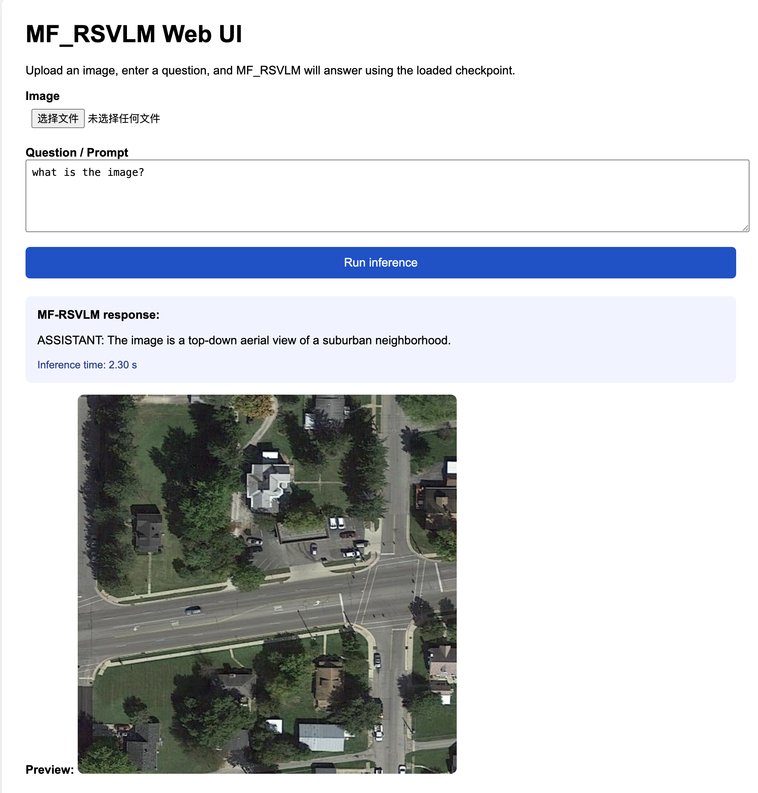

<h1 align="center">MF-RSVLM</h1>
<p align="center">
  <strong>FUSE-RSVLM: Feature Fusion Vision-Language Model for Remote Sensing</strong>
</p>

<p align="center">
  <a href="https://arxiv.org/abs/2512.24022" target="_blank">
    
  </a>
  <a href="https://huggingface.co/FelixKAI/mfrsvlm-7b_sft" target="_blank">
    
  </a>
  <a href="https://huggingface.co/datasets/FelixKAI/RSVLM-SFT" target="_blank">
    
  </a>
  
</p>

<p align="center">
  <a href="https://github.com/Yunkaidang/RSVLM">Project Page</a> |
  <a href="https://arxiv.org/abs/2512.24022">Paper</a> |
  <a href="https://huggingface.co/FelixKAI/mfrsvlm-7b_sft">Model</a> |
  <a href="https://huggingface.co/datasets/FelixKAI/RSVLM-SFT">Dataset</a>
</p>

> If this project helps you, please give us a star on GitHub.

## Overview
MF-RSVLM is a remote sensing vision-language model (VLM). It combines a CLIP vision encoder, a two-layer MLP projector, and a Vicuna-7B LLM, and is trained in two stages for modality alignment and instruction following.

- Visual Encoder: CLIP ViT-L/14 336px
- Projector: 2-layer MLP
- LLM: Vicuna-7B v1.5
- Training: Pretrain (VersaD 1.4M image-text pairs) + SFT (instruction tuning)

## Contents
- [Install](#install)
- [Repository Layout](#repository-layout)
- [Downloads](#downloads)
- [Training](#training)
- [Inference Demos](#inference-demos)
- [Evaluation](#evaluation)
- [Checkpoint Notes](#checkpoint-notes)
- [Citation](#citation)
- [Acknowledgement](#acknowledgement)
- [License](#license)

## Install
```bash
git clone git@github.com:opendatalab/MF-RSVLM.git
cd MF-RSVLM
conda create -n mf-rsvlm
conda activate mf-rsvlm
pip install -r requirements.txt
```

## Repository Layout
```
MF-RSVLM/
├── mfrsvlm/               # package code
│   ├── model/             # deepstack, builder, consolidate
│   ├── train/             # train_mem.py, train.py, trainer
│   ├── conversation.py
│   ├── constants.py
│   ├── mm_utils.py
│   └── utils.py
├── scripts/               # inference/eval/data-prep helpers + ZeRO configs
│   └── data/
├── checkpoints/           # mf-rsvlm-7b_pretrained, mf-rsvlm-7b_sft
├── models/                # vicuna-7b-v1.5, clip-vit-large-patch14-336, llava-mlp2x
├── requirements.txt
├── README.md
└── mf-rsvlm_checkpoint_notes.md
```

## Downloads
### Models
| Name | Link | Description |
|---|---|---|
| MF-RSVLM SFT | https://huggingface.co/FelixKAI/mfrsvlm-7b_sft | SFT stage LLM + MLP weights |
| MF-RSVLM SFT (FitzPC) | https://huggingface.co/FitzPC/mf-rsvlm_7B | SFT stage LLM + MLP weights |
| MF-RSVLM Pretrain (LLM + MLP) | https://huggingface.co/FitzPC/mf-rsvlm_7b_pretrain_mlp_llm/tree/main | Pretraining stage LLM + MLP |
| MF-RSVLM Pretrain (CLIP) | https://huggingface.co/FitzPC/mf-rsvlm_7b_pretrain_vit | Pretraining stage vision tower |
- LLaVA-1.5 MLP projector: https://huggingface.co/liuhaotian/llava-v1.5-mlp2x-336px-pretrain-vicuna-7b-v1.5/tree/main

### Datasets
- VersaD (pretraining): 1.4M image-text pairs. Prepare `list_pretrain.json` and set `DATA_DIR` and `LIST_FILE` in the script.
- MF-RSVLM_SFT (instruction tuning): https://huggingface.co/datasets/FitzPC/MF-RSVLM_dataset_sft
- RSVLM-SFT (instruction tuning): https://huggingface.co/datasets/FelixKAI/RSVLM-SFT


## Training
MF-RSVLM training has two stages: pretraining for modality alignment, and supervised fine-tuning (SFT) for instruction following.

### Pretrain
Run the Slurm script below to start pretraining:
```bash
sh scripts/rs/slurm_pretrain.sh
```

### Supervised Fine-Tuning
Run the Slurm script below to start SFT:
```bash
sh scripts/rs/slurm_finetune.sh
```

## Inference Demos
### Single-Sample Inference (CLI)
Use the lightweight helper to test a single image-question pair. This script loads the model once and prints the response directly in the terminal.

```bash
CUDA_VISIBLE_DEVICES=0 python scripts/run_mfrsvlm_inference.py \
  --model-path checkpoints/mfrsvlm-7b_sft \
  --image-path /path/to/image.png \
  --prompt "What is shown in the image?"
```


### Web Demo (Full-Model UI)
Start a simple Flask web interface for interactive evaluation. The server loads the checkpoint once, then serves a browser UI for repeated queries.

```bash
CUDA_VISIBLE_DEVICES=0 python scripts/run_mf-rsvlm_web_server.py \
  --model-path checkpoints/mfrsvlm-7b_sft \
  --host 0.0.0.0 \
  --port 7860
```

Open `http://localhost:7860` in your browser, upload an image, and enter a question to get the model response.

**Web UI Result**


## Evaluation
We provide a dedicated evaluation toolkit: [RSEvalKit](https://github.com/fitzpchao/RSEvalKit).

```bash
git clone https://github.com/fitzpchao/RSEvalKit
cd RSEvalKit
conda create -n rseval
conda activate rseval
pip install -r requirements.txt
```

Download the [model weights and datasets](#downloads), then follow the RSEvalKit README for one-click evaluation.

## Checkpoint Notes
For detailed training scripts and checkpoint notes, see `mf-rsvlm_checkpoint_notes.md`. Highlights:

- Pretraining checkpoints default to `checkpoints/mf-rsvlm-7b_pretrained`
- SFT checkpoints default to `checkpoints/mf-rsvlm-7b_sft*`
- Slurm logs are written via `tee` into `scripts/rs/pretrain_*.log`
- TensorBoard logs are under `checkpoints/<ckpt>/runs/`


## Citation
```bibtex
@article{dang2025fuse,
  title={FUSE-RSVLM: Feature Fusion Vision-Language Model for Remote Sensing},
  author={Dang, Yunkai and Wang, Donghao and Yang, Jiacheng and Jiang, Yifan and Zhu, Meiyi and Yang, Yuekun and Wang, Cong and Fan, Qi and Li, Wenbin and Gao, Yang},
  journal={arXiv preprint arXiv:2512.24022},
  year={2025}
}
```

## Acknowledgement
We gratefully acknowledge these wonderful works:
- [Vicuna](https://github.com/lm-sys/FastChat#vicuna-weights)
- [LLaVA](https://github.com/haotian-liu/LLaVA)
- [ShareGPT4V](https://github.com/InternLM/InternLM-XComposer/tree/main/projects/ShareGPT4V)
- [LLaMA](https://github.com/facebookresearch/llama)
- [VHM](https://github.com/opendatalab/VHM)
